<!-- Animated Header -->
<div align="center">

  

</div>

<!-- Animated Typing -->
<p align="center">
  <a href="https://git.io/typing-svg">
    
  </a>
</p>

<!-- Animated Badges -->
<p align="center">
  
  
  
  
</p>

<p align="center">
  
  
  
</p>

<!-- Quick Links -->
<p align="center">
  <a href="#-features"></a>
  <a href="#-tech-stack"></a>
  <a href="#-architecture"></a>
  <a href="#-api-reference"></a>
  <a href="#-getting-started"></a>
</p>

---

## 🎯 Overview


**Voltyks** is an enterprise-grade API platform that revolutionizes how Electric Vehicle owners connect with charging station providers. Our platform orchestrates the complete charging lifecycle — from discovering nearby chargers to seamless payment processing.

<br clear="right"/>

### 🎪 What Makes Voltyks Special?

<table>
<tr>
<td width="50%">

#### 🚗 For EV Owners
- 📍 Find nearby chargers instantly
- ⚡ Send real-time charging requests
- 💳 Pay securely with cards or wallets
- ⭐ Rate your charging experience

</td>
<td width="50%">

#### 🔌 For Charger Owners
- 📊 List and manage your chargers
- 🔔 Get instant request notifications
- 💰 Earn money from your chargers
- 📈 Build your reputation

</td>
</tr>
</table>

---

## ✨ Features

<div align="center">

| 🔋 Core | 🔐 Security | 💳 Payments | 📱 Mobile |
|:-------:|:-----------:|:-----------:|:---------:|
| Geolocation Search | JWT + Refresh Tokens | Paymob Integration | Push Notifications |
| Real-time Requests | OAuth (Google/FB) | Card Tokenization | Device Management |
| Two-way Ratings | OTP Verification | Mobile Wallets | Deep Linking |
| Wallet System | Role-based Access | Webhook Handling | Multi-language |

</div>

### 🎨 Feature Highlights


---

## 🛠 Tech Stack

<div align="center">

<!-- Animated Tech Icons -->
<a href="https://dotnet.microsoft.com/"></a>
<a href="https://docs.microsoft.com/en-us/dotnet/csharp/"></a>
<a href="https://azure.microsoft.com/"></a>
<a href="https://redis.io/"></a>
<a href="https://firebase.google.com/"></a>
<a href="https://www.docker.com/"></a>
<a href="https://git-scm.com/"></a>
<a href="https://github.com/"></a>
<a href="https://www.postman.com/"></a>
<a href="https://code.visualstudio.com/"></a>

</div>

<br/>

<details>
<summary><b>🔥 View Detailed Tech Stack</b></summary>
<br/>

<div align="center">

### Backend & Framework


### Database & Caching


### Authentication & Security


### Payment Integration


### SMS & Notifications


### Cloud & DevOps


</div>

</details>

---

## 🏗 Architecture

```mermaid
graph TB
    subgraph Client["📱 Client Layer"]
        iOS[iOS App]
        Android[Android App]
        Web[Web Dashboard]
    end

    subgraph API["🚀 API Gateway"]
        Controllers[Controllers]
        Middleware[Middleware]
        Auth[Auth Handler]
    end

    subgraph Services["⚙️ Business Logic"]
        AuthSvc[Auth Service]
        ChargerSvc[Charger Service]
        PaymentSvc[Payment Service]
        NotifySvc[Notification Service]
    end

    subgraph Data["💾 Data Layer"]
        EF[Entity Framework]
        Redis[(Redis Cache)]
        SQL[(Azure SQL)]
    end

    subgraph External["🌐 External Services"]
        Paymob[Paymob API]
        Firebase[Firebase FCM]
        SMS[SMS Providers]
    end

    Client --> API
    API --> Services
    Services --> Data
    Services --> External

    style Client fill:#6C63FF,color:#fff
    style API fill:#FF6B6B,color:#fff
    style Services fill:#4ECDC4,color:#fff
    style Data fill:#45B7D1,color:#fff
    style External fill:#96CEB4,color:#fff
```

<div align="center">



</div>

### 📁 Project Structure

```
📦 Voltyks.API
├── 🎯 Voltyks.API                    # Presentation Layer
│   ├── 📂 Controllers/               # API Endpoints
│   ├── 📂 Middleware/                # Request Pipeline
│   └── 📂 Extensions/                # DI Configuration
│
├── 💼 Voltyks.Application            # Business Logic
│   ├── 📂 Services/                  # Core Services
│   ├── 📂 Interfaces/                # Contracts
│   └── 📂 Validators/                # Input Validation
│
├── 🎨 Voltyks.Core                   # Domain Layer
│   ├── 📂 DTOs/                      # Data Transfer Objects
│   ├── 📂 Enums/                     # Enumerations
│   └── 📂 Exceptions/                # Custom Exceptions
│
├── 💾 Voltyks.Persistence            # Data Access
│   ├── 📂 Entities/                  # Database Models
│   ├── 📂 Configurations/            # EF Configurations
│   └── 📂 Migrations/                # DB Migrations
│
├── 🔧 Voltyks.Infrastructure         # Infrastructure
│   ├── 📂 Repositories/              # Data Repositories
│   └── 📂 UnitOfWork/                # Transaction Management
│
└── 🛡️ Voltyks.AdminControlDashboard  # Admin Features
    └── 📂 Services/                  # Admin Services
```

---

## 📡 API Reference

<div align="center">

### 🔐 Authentication

</div>

| Method | Endpoint | Description | Auth |
|:------:|:---------|:------------|:----:|
| `POST` | `/api/Auth/Login` | User login with JWT | ❌ |
| `POST` | `/api/Auth/register` | Create new account | ❌ |
| `POST` | `/api/Auth/RefreshToken` | Refresh JWT token | 🔑 |
| `POST` | `/api/Auth/forget-password` | Request password reset | ❌ |
| `POST` | `/api/Auth/reset-password` | Reset with OTP | ❌ |
| `GET` | `/api/Auth/GetProfileDetails` | Get user profile | 🔑 |
| `PUT` | `/api/Auth/toggle-availability` | Toggle availability | 🔑 |
| `GET` | `/api/Auth/wallet` | Get wallet balance | 🔑 |

<details>
<summary><b>🔌 Chargers API</b></summary>

| Method | Endpoint | Description | Auth |
|:------:|:---------|:------------|:----:|
| `GET` | `/api/Charger/GetCapacity` | Get capacities | ❌ |
| `GET` | `/api/Charger/GetProtocol` | Get protocols | ❌ |
| `GET` | `/api/Charger/GetPrices` | Get price list | ❌ |
| `POST` | `/api/Charger/AddCharger` | Register charger | 🔑 |
| `GET` | `/api/Charger/GetChargersByUser` | My chargers | 🔑 |
| `POST` | `/api/Charger/GetNearChargers` | Find nearby | 🔑 |
| `PUT` | `/api/Charger/ToggleStatus` | Toggle status | 🔑 |

</details>

<details>
<summary><b>⚡ Charging Requests API</b></summary>

| Method | Endpoint | Description | Auth |
|:------:|:---------|:------------|:----:|
| `POST` | `/api/ChargingRequest/sendChargingRequest` | Send request | 🔑 |
| `PUT` | `/api/ChargingRequest/AcceptRequest` | Accept | 🔑 |
| `PUT` | `/api/ChargingRequest/RejectRequest` | Reject | 🔑 |
| `PUT` | `/api/ChargingRequest/ConfirmRequest` | Confirm start | 🔑 |
| `PUT` | `/api/ChargingRequest/abortRequest` | Abort session | 🔑 |

</details>

<details>
<summary><b>💳 Payments API</b></summary>

| Method | Endpoint | Description | Auth |
|:------:|:---------|:------------|:----:|
| `POST` | `/api/payment/intention` | Create payment | 🔑 |
| `POST` | `/api/payment/webhook` | Paymob webhook | ❌ |
| `GET` | `/api/payment/GetListOfCards` | Saved cards | 🔑 |
| `POST` | `/api/payment/payWithSavedCard` | Pay with card | 🔑 |
| `DELETE` | `/api/payment/delete_Card` | Delete card | 🔑 |

</details>

---

## ⚡ Quick Start

### Prerequisites

<div align="center">


</div>

### 🚀 Installation

```bash
# Clone the repository
git clone https://github.com/AhmedSalem104/Voltyks.API.git

# Navigate to project
cd Voltyks.API

# Restore dependencies
dotnet restore

# Apply database migrations
cd Voltyks.API
dotnet ef database update

# Run the application
dotnet run
```

### 🔧 Configuration

<details>
<summary><b>📝 appsettings.json Example</b></summary>

```json
{
  "ConnectionStrings": {
    "DefaultConnection": "Server=your-server;Database=VoltyksDB;...",
    "Redis": "your-redis-url:6379,password=***,ssl=True"
  },
  "JwtOptions": {
    "Issuer": "https://your-domain.com",
    "Audience": "YourAudience",
    "SecurityKey": "your-super-secret-key-min-32-chars",
    "ExpiresInMinutes": 43200
  },
  "Paymob": {
    "ENV": "test",
    "ApiKey": "your-api-key",
    "SecretKey": "your-secret-key",
    "PublicKey": "your-public-key"
  },
  "Firebase": {
    "ProjectId": "your-project-id",
    "ServiceAccountFile": "Firebase/service-account-key.json"
  }
}
```

</details>

---

## 📊 API Response Format

<table>
<tr>
<td width="50%">

### ✅ Success Response
```json
{
  "data": { ... },
  "message": "Operation successful",
  "status": true,
  "errors": []
}
```

</td>
<td width="50%">

### ❌ Error Response
```json
{
  "data": null,
  "message": "Error description",
  "status": false,
  "errors": ["Error 1", "Error 2"]
}
```

</td>
</tr>
</table>

### 📄 Paginated Response

```json
{
  "data": {
    "items": [...],
    "pageNumber": 1,
    "pageSize": 20,
    "totalPages": 5,
    "totalCount": 100,
    "hasPreviousPage": false,
    "hasNextPage": true
  },
  "message": "Data fetched successfully",
  "status": true
}
```

---

## 🔄 Charging Workflow

```mermaid
sequenceDiagram
    participant EV as 🚗 EV Owner
    participant API as ⚡ Voltyks API
    participant CO as 🔌 Charger Owner
    participant Pay as 💳 Paymob

    EV->>API: 1. Search nearby chargers
    API-->>EV: Return available chargers

    EV->>API: 2. Send charging request
    API->>CO: 3. Push notification

    CO->>API: 4. Accept request
    API-->>EV: 5. Request accepted

    EV->>API: 6. Confirm charging started
    API->>CO: 7. Notify charging started

    Note over EV,CO: ⚡ Charging in progress...

    EV->>API: 8. Complete session
    API->>Pay: 9. Process payment
    Pay-->>API: Payment confirmed

    EV->>API: 10. Submit rating
    CO->>API: 11. Submit rating

    API-->>EV: ✅ Session completed
    API-->>CO: ✅ Payment received
```



---

## 💰 Fee Structure

<div align="center">

```
┌─────────────────────────────────────────────────────┐
│                  Fee Calculation                     │
├─────────────────────────────────────────────────────┤
│                                                      │
│   Base Amount (Charger Owner)     =    100 EGP      │
│   Minimum Platform Fee            =      5 EGP      │
│   Percentage Fee (10%)            =     10 EGP      │
│                                                      │
│   Platform Fee = max(5, 100 × 10%) =    10 EGP      │
│   ─────────────────────────────────────────────     │
│   Total Charged to EV Owner       =   110 EGP      │
│                                                      │
└─────────────────────────────────────────────────────┘
```

</div>

---

## 🔒 Security

<div align="center">

| Feature | Implementation |
|:-------:|:--------------|
| 🔐 | JWT tokens with configurable expiration |
| 🔄 | Refresh tokens stored in Redis |
| ✅ | HMAC verification for webhooks |
| 🚫 | Rate limiting for OTP attempts |
| 🛡️ | User banning system |
| 🔒 | HTTPS enforced in production |

</div>

---

## 📚 Documentation

<div align="center">

| Document | Description |
|:--------:|:------------|
| [📖 PaginationAPI.md](./Docs/PaginationAPI.md) | Pagination implementation guide |
| [📖 ComplaintSystemAPI.md](./Docs/ComplaintSystemAPI.md) | Complaint system documentation |
| [📖 Swagger UI](https://voltyks-dqh6fzgwdndrdng7.canadacentral-01.azurewebsites.net/swagger) | Interactive API documentation |

</div>

---

## 🚀 Deployment

```mermaid
graph LR
    A[💻 Local Dev] --> B[🔧 Build]
    B --> C[🧪 Test]
    C --> D[📦 Publish]
    D --> E[☁️ Azure App Service]

    style A fill:#6C63FF,color:#fff
    style B fill:#FF6B6B,color:#fff
    style C fill:#4ECDC4,color:#fff
    style D fill:#45B7D1,color:#fff
    style E fill:#96CEB4,color:#fff
```

<div align="center">



</div>

```bash
# Build for production
dotnet publish -c Release -r linux-x64 --self-contained false

# Deploy via Azure CLI
az webapp deploy --resource-group VoltyksAPI_RG --name Voltyks --src-path ./publish.zip
```

---

## 🤝 Contributing

<div align="center">

Contributions are welcome! Please feel free to submit a Pull Request.

[](http://makeapullrequest.com)

</div>

1. Fork the repository
2. Create your feature branch (`git checkout -b feature/AmazingFeature`)
3. Commit your changes (`git commit -m 'Add some AmazingFeature'`)
4. Push to the branch (`git push origin feature/AmazingFeature`)
5. Open a Pull Request

---

## 📄 License

<div align="center">

This project is proprietary software. All rights reserved.

[](LICENSE)

</div>

---

## 👨‍💻 Author

<div align="center">

**Ahmed Salem**

[](https://github.com/AhmedSalem104)
[](https://linkedin.com/in/ahmedsalem104)

</div>

---

<!-- Animated Footer -->
<div align="center">


**Voltyks** — Powering the Future of EV Charging ⚡

<sub>Built with ❤️ using .NET 8 | Deployed on Microsoft Azure</sub>

</div>
